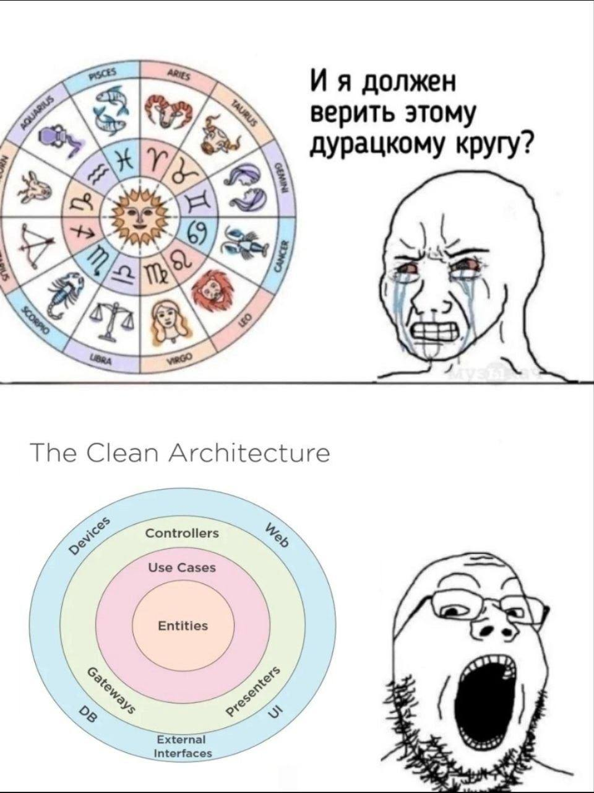

# Архитектура



Материалы для лекции об архитектуре и проектировании приложений в рамках GPB IT Factory Backend 2024.

## Связь архитектуры и проектирования приложений

Архитектура (software architecture) и проектирование (software design) — это два хоть и разных, но взаимосвязанных аспекта разработки программного обеспечения. 

Архитектура программного обеспечения описывает высокоуровневую структуру системы:
- высокоуровневые решения (вид интеграций, управление данными и пр.);
- технологический стэк;
- нефункциональные требования;
- архитектурный стиль (монолиты, микросервисы, событийная архитектура и т. д.)
Архитектура является фундаментом, на котором строится вся дальнейшая разработка. Архитектура отвечает на вопрос "что?"

Проектирование опускается на уровень деталей и направлено на реализацию конкретной архитектуры. Отвечает на вопрос "как?"

Архитектура и проектирование часто пересекаются. Архитектура задает общую структуру и направления, по которым будет развиваться система, а проектирование уточняет эти направления и приводит их к реализации.
Поэтому очень часто при обсуждениях под "архитектурой" может пониматься как архитектурное решение, так и её конкретная реализация.

Пример для наглядности:
```text
Архитектурное решение: выбор "Чистой архитектуры" для проекта
Проектирование: проектирование  слоев, интерфейсов, репозиториев, доменных моделей и т. д. согласно принципам "Чистой архитектуры"
```

## Какие проблемы решает архитектура?

Мы хотим писать системы и приложения, которые способны решать проблемы наших клиентов в течение продолжительного времени и с минимальным количеством ошибок или отказов.
Также в современном мире (и в разработке) очень важна скорость и гибкость - нужно адаптироваться под нужды клиента или под новые обстоятельства.
Архитектурные решения направлены на то, чтобы воплотить эти желания, обеспечивая:
- простоту решения (борьбу со сложностью);
- гибкость, адаптивность и возможность развития;
- поддерживаемость, управляемость, безопасность;
- надежность, отказоустойчивость и масштабируемость;
- тестируемость, переиспользование т. д.

## Как спроектировать такое решение?

С точки зрения проектирования мы стараемся решить проблемы с помощью следующих концепций:
- модульность;
- связность (cohersion) и связанность (coupling);
- разделение ответственности;
- абстракция и инкапсуляция.

Большая часть архитектурных решений использует эти концепции и предоставляет шаблон для того, чтобы сделать решение более гибким и поддерживаемым.
На примере "чистой архитектуры".
```text
Разделение на слои - разделение ответственности, а также балансировка связностью и связанностью.
Изолированная бизнес-логика - инкапсуляция.
Независимость от конкретной базы данных, от UI и от внешних сервисов - абстракция.
```

## Выбранная архитектура != структура проекта

Важный момент: архитектура - это НЕ структура проекта. Структура проекта может быть разной, при этом
следовать выбранной архитектуре.

Disclaimer: распределение по пакетам подвергайте сомнению - это просто пример того, какие подходы можно использовать для разделения, он может
быть неверен или неэффективен для вашей задачи.

Примеры разных решений по структуре проекта в рамках "Чистой архитектуры":
- [Вариант 1](clean_architecture_structure_v1.md)
- [Вариант 2](clean_architecture_structure_v2.md)
- [Вариант 3 (не для использования)](clean_architecture_structure_v3.md)
- [Вариант 4](is_it_really_clean_architecture_structure_v4.md)